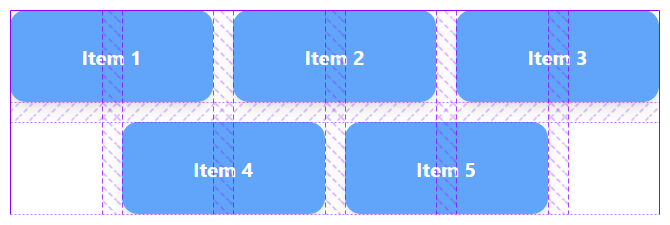

# @khoohaoyit/tailwind-grid-center

<a href="https://github.com/KhooHaoYit/tailwind-grid-center/blob/main/LICENSE">
  
</a>
<a href="https://github.com/KhooHaoYit/tailwind-grid-center/releases">
  
</a>

A tailwind plugin that center items on last row in a grid.

## Installation

Install the plugin from npm:

```sh
npm i -D @khoohaoyit/tailwind-grid-center
```

Then add the plugin to your `tailwind.config.js` file:

```js
// tailwind.config.js
module.exports = {
  theme: {
    // ...
  },
  plugins: [
    require('@khoohaoyit/tailwind-grid-center'),
    // ...
  ],
};
```

## Usage

Use the `grid-cols-center-{n}` utilities to specify the amount of columns in a grid:

```html
<div class="grid grid-cols-center-3">
  <div>Item 1</div>
  <div>Item 2</div>
  <div>Item 3</div>
  <div>Item 4</div>
  <div>Item 5</div>
</div>
```

The respective utilities would generate:

```css
.grid-cols-center-3 {
  grid-template-columns: repeat(6, minmax(0, 1fr));
}
.grid-cols-center-3 > * {
  grid-column: span 2;
}
.grid-cols-center-3 > *:nth-last-child(1):nth-child(3n + 1) {
  grid-column-end: -3;
}
.grid-cols-center-3 > *:nth-last-child(2):nth-child(3n + 1) {
  grid-column-end: -4;
}
.grid-cols-center-3 > *:nth-last-child(1):nth-child(3n + 2) {
  grid-column-end: -2;
}
```

> Note that the output it generates is polynomial, so `grid-cols-center-[10]` would generate 47 classes in total.

The gridline would look like this:



To use it with [`responsive modifiers`](https://tailwindcss.com/docs/responsive-design), you need to use `tailwindcss@^3.2` using [`max-width` or `dynamic breakpoints`](https://tailwindcss.com/blog/tailwindcss-v3-2#max-width-and-dynamic-breakpoints):

```html
<div class="grid max-sm:grid-cols-center-2 sm:max-lg:grid-cols-center-3 lg:grid-cols-center-4">
  ...
</div>
```

## Configuration

You can configure which values are generated by this plugin under the `gridTemplateColumnsCenter` key in your `tailwind.config.js` file:

```js
// tailwind.config.js
module.exports = {
  theme: {
    extend: {
      gridTemplateColumnsCenter: {
        13: '13',
        14: '14',
        15: '15',
        16: '16',
      },
    },
  },
};
```

Utilities for centering items in a grid are generated up to 12 columns by default.

## Links
 - [How it works](https://css-irl.info/controlling-leftover-grid-items) by css-irl.info
